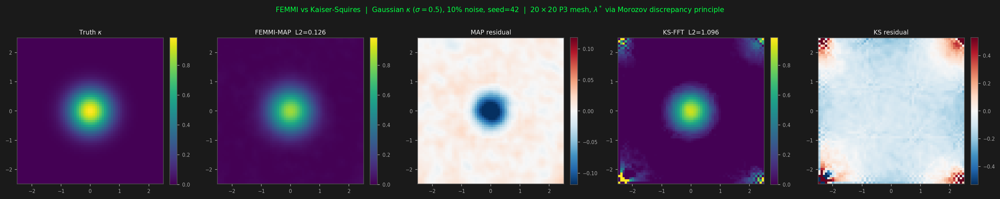
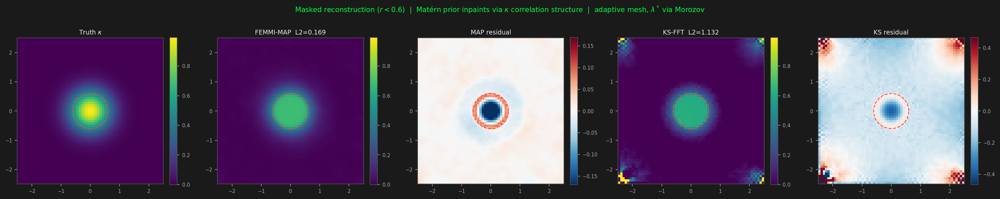
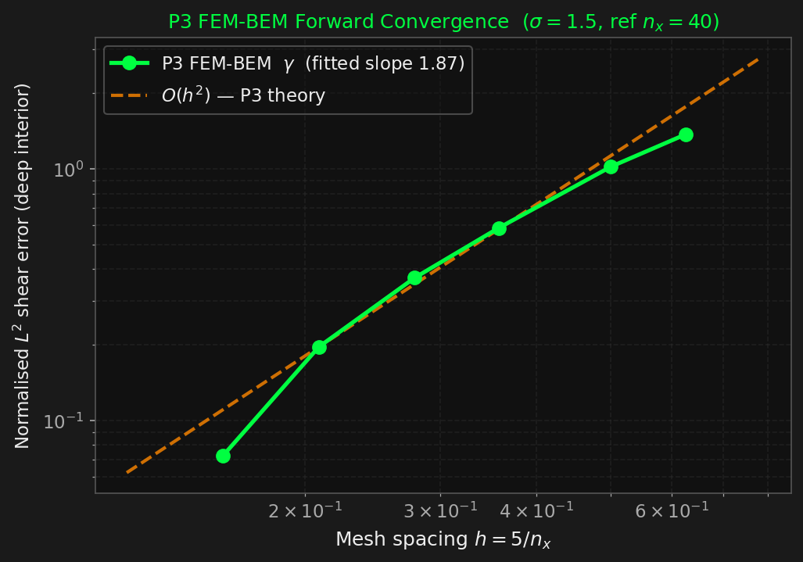

# FEMMI: Finite Element Mass Map Inversion

[](https://femmi.readthedocs.io/en/latest/)
[](LICENSE.md)
[](https://www.python.org/)

Weak gravitational lensing mass reconstruction via P3 FEM-BEM coupled boundary value problems, with automatic Morozov-regularised MAP inversion and inverse-scattering support recovery.

New here? [`examples/quickstart.py`](examples/quickstart.py) reconstructs a mass map from a shear catalog in about a dozen lines.

---

## Overview

FEMMI reconstructs the projected mass density $\kappa(\boldsymbol{\theta})$ of a gravitational lens from observed weak-lensing shear $(\gamma_1, \gamma_2)$. The lensing potential $\psi$ satisfies

$$\nabla^2\psi = 2\kappa \quad \text{in } \mathbb{R}^2, \qquad \psi(\boldsymbol{\theta}) \to 0 \text{ as } |\boldsymbol{\theta}| \to \infty,$$

with shear components

$$\gamma_1 = \tfrac{1}{2}\left(\frac{\partial^2\psi}{\partial\theta_1^2} - \frac{\partial^2\psi}{\partial\theta_2^2}\right), \qquad \gamma_2 = \frac{\partial^2\psi}{\partial\theta_1 \partial\theta_2}.$$

The central methodological claim is that the standard practice of truncating this problem to a finite domain with Dirichlet boundary conditions ($\psi = 0$ on $\partial\Omega$) encodes the wrong continuous operator: the true $\psi$ decays only logarithmically and is nonzero at any finite boundary. The resulting systematic error propagates throughout the interior by the maximum principle. FEMMI replaces this with an exact exterior representation via boundary elements, enforcing the correct far-field condition without approximation.

| Feature | Kaiser-Squires (1993) | FEMMI |
|---|---|---|
| Far-field boundary condition | Periodic / Dirichlet (wrong) | Exact exterior via BEM |
| Regularisation parameter | Manual smoothing kernel | Morozov discrepancy principle |
| DC / mass-sheet mode | In $F$'s null space (exactly) | Observable ($\|F\mathbf{1}\|>0$) — but see the scope note below |
| Inverse method | Direct FFT | MAP + L-BFGS, Matérn prior |
| Masked / missing data | Unreliable near mask | Inpainting via prior covariance |
| E/B-mode null test | 45-deg rotation | 45-deg rotation (same solver) |
| Source positions | Binned grid | Catalog-native (raw galaxy positions) |
| Element order | N/A | P3 cubic (required for $\nabla^2\psi$) |

---

## Mathematical Foundations

Full derivations are in [`MATH.md`](MATH.md). The key ideas:

**FEM-BEM coupling.** A P3 FEM interior solves $\nabla^2\psi = 2\kappa$ in $\Omega$ while a boundary element method encodes $\nabla^2\psi = 0$ in the exterior and $\psi \to 0$ at infinity. The coupled stiffness matrix is assembled via Schur complement reduction:

$$A_{\mathrm{coupled}} = K + P^\top C P, \qquad C = -M_b\, V_\sigma^{-1}\left(\tfrac{1}{2}M_b - K_h\right),$$

where $K$ is the Neumann stiffness (no Dirichlet row modification), $V_h$ the single-layer BEM matrix, $K_h$ the double-layer matrix, $M_b$ the boundary mass matrix, $P$ the DOF restriction to $\partial\Omega$, and $V_\sigma = V_h - \tfrac{\ln\sigma}{2\pi} \mathbf{w}\mathbf{w}^\top$ ($\mathbf{w}=M_b\mathbf{1}$, $\sigma=\mathrm{diam}(\partial\Omega)$) the $\sigma$-scaled single layer. This is the **symmetric Steinbach coupling**: the Galerkin $M_b$ pairing makes it scale-free and the rank-one $\sigma$-scaling repairs the 2D $n=0$ log-capacity mode, giving a scale- and translation-invariant far-field condition that beats a Dirichlet truncation near the mass (see [`MATH.md`](MATH.md) §6.5). The coupling $C$ is assembled once and stored; each forward solve requires two SuperLU triangular solves (forward and adjoint).

**Why P3 elements.** Shear is the Hessian of $\psi$: $\gamma_1 = \frac{1}{2}(\partial^2\psi/\partial x^2 - \partial^2\psi/\partial y^2)$, $\gamma_2 = \partial^2\psi/\partial x\partial y$. P1 elements give identically zero second derivatives; P2 gives piecewise-constant second derivatives with no convergence. P3 gives piecewise-linear second derivatives and $O(h^2)$ shear convergence. The 10-node P3 Lagrange element used here achieves $O(h^4)$ in $L^2$ for the Poisson solve.

**MAP reconstruction.** The estimate minimises

$$\mathcal{L}(\kappa) = \|F\kappa - \gamma_{\mathrm{obs}}\|^2 + \lambda\,\phi(\kappa), \qquad \phi_{\mathrm{Wiener}}(\kappa) = \kappa^\top R\kappa, \quad R = M + \ell^2 K \text{ (Matérn-}\tfrac{1}{2}\text{ prior, default)}.$$

**Pluggable priors** (`femmi/priors.py`). The penalty $\phi$ is a swappable `Prior` object returning $(\phi, \nabla\phi)$; the Gaussian/Matérn **Wiener** prior is the default. Non-Gaussian options capture structure the 2-point prior cannot: **total variation** (edge-preserving, sharp cluster cores), **sparsity** (smoothed-$L_1$, compact peaks à la GLIMPSE / Jeffrey et al. 2018), **maximum entropy** (positive maps, Marshall et al. 2002), and a **`ScorePrior`** hook that accepts any callable score $\nabla\log p(\kappa)$. Morozov $\lambda$-selection applies to the quadratic Wiener prior; the others take a fixed $\lambda$. `examples/prior_comparison.py` and `examples/diagnostics/prior_bakeoff.py` (λ-tuned) compare them.

**Learned neural prior** (`femmi/neural_prior/`, one flag away). `prior='neural'` plugs in a score network $r_\theta(\kappa,\sigma)\approx\nabla\log p_\sigma(\kappa)$ trained by Denoising Score Matching (Remy et al. 2020) — it models the *non-Gaussian residual* on top of the Gaussian score FEMMI already has. It is self-contained: first use trains a small default model (Flax) on synthetic non-Gaussian (shifted-log-normal) maps and caches it — no external data, no extra steps. Because the forward is differentiable, the *same* learned score drives posterior sampling.

**Posterior UQ** (`femmi/sampling.py`). `sample_posterior` returns the posterior mean and a per-pixel uncertainty map, exploiting the differentiable forward: exact **perturb-and-MAP** (Randomize-Then-Optimize) for the Gaussian/Wiener posterior, and the paper's **annealed HMC** (tempered, noise-conditional score + score-integral Metropolis) for non-Gaussian/neural priors, with single-temperature Langevin as a fallback. The prior weight is **auto-calibrated** by default (`inverse.lam: null`): the Wiener posterior reuses the MAP's Morozov selection (converted to the sampler's noise-normalised convention, `lam = lam_MAP / 2σ_n²`), and the neural score prior gets the proper Bayesian coefficient 1.0 — leaving `lam` uncalibrated makes the data term (weight `1/σ_n²`) swamp the prior and the posterior collapses to noise. `examples/uncertainty_demo.py`; `examples/paper_artifacts.py` reproduces the Remy et al. figure structure (truth · mask · KS · posterior mean · uncertainty · samples) on masked, noisy data.

$\lambda$ is selected automatically by Brent's method on the discrepancy functional 

$$D(\lambda) = \|F\kappa_\lambda - \gamma_{\mathrm{obs}}\|_{\mathrm{RMS}} - c\delta$$

(Morozov 1966; C&L Thm 10.4), using 15-25 MAP solves. The gradient is computed via the adjoint: 

$$\partial\mathcal{L} / \partial\kappa = -4M A_{\mathrm{coupled}}^{-T}(S_1^\top r_1 + S_2^\top r_2) + 2\lambda R\kappa .$$

**Injectivity and the mass-sheet degeneracy — with its scope.** The BEM far-field normalization removes the $\kappa \to \kappa + c$ mode from the null space of $F$, where every FFT-based method has it identically ($\|F_{\rm KS}\mathbf{1}\| = 0$ exactly, because the $1/k^2$ kernel is singular at $k=0$ and is zeroed there). A single-node gauge condition removes the remaining scalar null space (the additive constant in $\psi$).

That is an operator-level statement and it is the correct one to make. It does **not** mean the absolute normalisation is recovered in practice, and measurement says it is not: ~99.9% of $\|F\mathbf{1}\|^2$ sits in the corners of the square domain and *grows* under refinement rather than converging, and on ground truth that FEMMI did not itself generate its mean-$\kappa$ error is $0.047$ against Kaiser–Squires' $0.049$. The much larger gap sometimes quoted comes from generating the test shear with FEMMI's own forward — an inverse crime. See `MATH.md` §6.3a and `examples/paper/independent_truth.py`.

What *does* survive on neutral truth is the boundary claim: FEMMI's exact far-field condition gives ~1.7× lower error than KS near the domain edge, with the margin growing outward.

**Inverse scattering connection.** The forward operator $F: L^2(\Omega) \to L^2(\Omega)^2$ is compact, placing the lensing problem in the same mathematical framework as the Born approximation in acoustic inverse scattering (C&K Ch. 8, 10). FEMMI implements the Kirsch factorization method and linear sampling method for parameter-free support recovery from the truncated SVD of $F$.

---

## Preliminary Results

Synthetic benchmarks on a Gaussian convergence field ($\sigma_\kappa = 0.5$, $20\times20$ P3 mesh on $[-2.5, 2.5]^2$). MAP uses automatic $\lambda$ selection via Morozov's principle with a Matérn prior ($\ell = \sigma_\kappa$). Kaiser-Squires uses the standard FFT inversion. Figures generated by `examples/diagnostics/generate_figures.py`.

### Reconstruction at 10% noise (single realisation, seed=42)



### Masked field ($r < 0.6$), adaptive mesh

The Matérn prior propagates $\kappa$ correlation structure into the masked region; KS-FFT collapses near the mask boundary.



### Forward operator convergence

$O(h^2)$ shear convergence validated on mesh sequence $n_x \in \{8, 10, 14, 18, 24, 32\}$ against a reference mesh ($n_x = 40$), with $\sigma = 1.5$ to ensure $\sigma/h \geq 1$ on all test meshes.



| Mesh transition | $\|\gamma_h - \gamma_{\mathrm{ref}}\|$ rate | Theory |
|---|---|---|
| $8 \to 14$ | $\approx 2.0$ | $O(h^2)$ |
| $14 \to 32$ | $\approx 2.0$ | $O(h^2)$ |

---

## Codebase Structure

```
femmi/
├── __init__.py
├── types.py             # Mesh namedtuple
├── mesh.py              # Structured and adaptive P3 mesh generation
├── basis.py             # P3 Lagrange basis (10 DOF/element)
├── assembly.py          # P3 element stiffness/mass assembly
├── bem.py               # BEM: V_h, K_h, M_b, Calderon operator
├── operators.py         # K, M, S1, S2, A_coupled; FEMOperators dataclass
├── forward.py           # DifferentiableForward (JAX custom_vjp)
├── inverse.py           # MAPReconstructor (E/B + bmode_diagnostics, data_weight, prior=), kaiser_squires
├── priors.py            # Pluggable priors: Wiener (default), TV, sparsity, max-entropy, ScorePrior hook
├── sampling.py          # Posterior UQ: perturb-and-MAP (RTO) + score-based Langevin
├── neural_prior/        # Learned score prior (Flax): denoiser, DSM training, NeuralScorePrior
├── catalog.py           # reconstruct_catalog, kaiser_squires_binned, synthetic catalog
├── io.py                # FITS shear catalog -> tangent plane (ShearCatalog/FlatCatalog)
├── regularization.py    # MorozovSelector, estimate_noise_level
├── config.py            # layered YAML config loader (whole-pipeline schema)
├── pipeline.py          # config -> build forward, get data, run MAP/sampling, save
├── cli.py               # `femmi` command (run / train-prior), --set overrides
└── svd_analysis.py      # SVD of F, Picard diagnostic, FactorizationIndicator, LSM

configs/                 # YAML run configs (default.yaml, paper_artifacts.yaml)
scripts/                 # SLURM submitter (femmi.sbatch)

tests/
├── test_fem_bem_coupling.py    # BEM matrices (V_h, K_h, M_b, Calderon)
├── test_coupled_pipeline.py    # FEM-BEM pipeline invariants
├── test_morozov.py             # Morozov lambda selection, monotonicity
├── test_factorization.py       # SVD, Picard, support recovery
├── test_convergence_p3.py      # O(h^4) L2 Poisson convergence
├── test_convergence.py         # Forward operator gamma convergence
├── test_eb_modes.py            # E/B decomposition, rotation identity, null test
├── test_bmode_diagnostics.py   # B-mode quality flag + noise-floor cross-check
├── test_catalog_pipeline.py    # Catalog-native reconstruction + binned KS + deflection
├── test_bc_ablation.py         # Boundary-condition machinery (Dirichlet operator)
├── test_bem_scaling.py         # Steinbach coupling scale-invariance vs Dirichlet
├── test_steinbach_coupling.py  # Steinbach coupling: sigma-scaling, scale/translation invariance
├── test_priors.py             # Pluggable priors: gradient FD checks, default-path parity
├── test_sampling.py           # Posterior sampling: RTO exactness, Langevin, UQ maps
├── test_neural_prior.py       # Neural score prior: binning bridge, DSM, plug-in (flax-gated)
└── test_regression.py          # End-to-end NFW reconstruction

examples/                        # teaching set -- walks the public API (see examples/README.md)
├── quickstart.py               # Minimal: reconstruct a mass map from a catalog (start here)
├── catalog_comparison.py       # Catalog-native FEMMI vs Fourier-grid KS head-to-head
├── prior_comparison.py         # Wiener vs TV vs sparsity vs max-entropy on one catalog
├── uncertainty_demo.py         # Posterior mean + per-pixel uncertainty map (RTO / neural)
├── plot_npz.py                 # Plot the .npz a `femmi run` writes (truth / kappa / std)
├── paper_artifacts.py          # Remy et al. 2020 figure structure: masked/noisy probabilistic map
└── diagnostics/                # development & validation scripts (not needed to learn the API)
    ├── generate_figures.py         # Preliminary results figures (self-contained)
    ├── generate_presentation_figures.py
    ├── eb_modes_demo.py            # E/B-mode decomposition figure
    ├── bc_ablation.py              # BEM vs Dirichlet vs Periodic boundary-condition study
    ├── bem_scaling_diagnostic.py   # BEM coupling scale-invariance: diagnosis + resolution
    ├── bem_dtn_diagnostic.py       # Exterior-DtN test: scalar fix vs symmetric Steklov-Poincare
    ├── prior_bakeoff.py            # Prior bake-off with per-prior lambda tuning (+ --neural)
    ├── galsim_nfw_benchmark.py     # GalSim NFW benchmark (independent truth): L2(kappa/gamma/psi)
    ├── bmode_dipole_diagnostic.py  # Off-centre B-mode: under-regularisation, not gauge (verdict)
    ├── smpy_comparison.py          # Full Monte Carlo benchmark vs SMPy KS
    ├── pme_talk_plots.py           # Perturb-and-MAP talk plots
    └── visualize_results.py        # SVD modes, Picard, convergence diagnostics
```

---

## Installation

```bash
git clone https://github.com/AdamField118/FEMMI.git
cd FEMMI
pip install -e ".[dev]"
```

**Requirements:** Python 3.10+, JAX >= 0.4, SciPy >= 1.11, NumPy >= 1.25, matplotlib.

**64-bit arithmetic is mandatory.** FEMMI enforces this at import time via `jax.config.update("jax_enable_x64", True)`. For a $20\times20$ mesh, $\kappa(A_{\mathrm{coupled}}) = O(1600)$; in 32-bit the solve error $O(\kappa\varepsilon_{32}) \approx 2\times10^{-5}$ dominates the P3 discretisation error $h^4 \approx 6\times10^{-6}$. (The learned score network is the exception — it runs JIT-compiled in float32, since a prior does not need 64-bit precision and float64 convolutions are needlessly slow on a GPU.)

### One command, one config

A whole run — forward operator, data, inverse (MAP or posterior sampling), prior, output — is described by a single YAML config (see [`configs/default.yaml`](configs/default.yaml)) and executed by the `femmi` command:

```bash
femmi run --config configs/default.yaml                        # synthetic MAP
femmi run --config configs/default.yaml --set inverse.method=sample --set prior.kind=neural
femmi run --config my_cluster.yaml --set data.source=frontier --set data.frontier_dir=data/abell2744/...
```

`--set key=value` overrides any config value (dot-notation), so there are no bespoke flags per script. The same config drives specific recreation scripts too, e.g. `python examples/paper_artifacts.py --config configs/paper_artifacts.yaml` turns a run into the Remy-et-al.-style figures.

On SLURM, submit [`scripts/femmi.sbatch`](scripts/femmi.sbatch) — it requests a GPU, sets `XLA_PYTHON_CLIENT_PREALLOCATE=false` (JAX grows GPU memory on demand instead of pre-grabbing it), and runs the config:

```bash
sbatch scripts/femmi.sbatch configs/my_run.yaml inverse.method=sample prior.kind=neural
```

The FEM forward stays in **float64** on the CPU (it needs the precision to converge); only the learned score network runs JIT-compiled in float32 on the GPU.

---

## Quick Start

```python
import numpy as np
from femmi.operators      import build_operators
from femmi.forward        import DifferentiableForward
from femmi.inverse        import MAPReconstructor
from femmi.regularization import estimate_noise_level

# Build mesh and operators (20x20 P3 mesh on [-2.5, 2.5]^2)
ops = build_operators(nx=20, ny=20, xmin=-2.5, xmax=2.5, ymin=-2.5, ymax=2.5)

# Synthetic convergence field and noiseless forward model
nodes      = np.array(ops.mesh.nodes)
kappa_true = np.exp(-(nodes[:, 0]**2 + nodes[:, 1]**2) / (2 * 0.5**2))
g1, g2     = ops.forward(kappa_true)

# Add 10% noise
noise = 0.10 * np.std(np.hypot(g1, g2))
rng   = np.random.default_rng(42)
g1_obs = g1 + rng.normal(0, noise, g1.shape)
g2_obs = g2 + rng.normal(0, noise, g2.shape)

# MAP reconstruction with automatic lambda (Morozov)
noise_std = estimate_noise_level(np.concatenate([g1_obs, g2_obs]), method='mad')
fwd = DifferentiableForward(ops, lam_reg=1e-3)
rec = MAPReconstructor(fwd, noise_std=noise_std, wiener_length=0.5)
kappa_map, result = rec.reconstruct(g1_obs, g2_obs)
```

```python
# Catalog-native reconstruction, straight from a galaxy shear catalog
# (FEM nodes placed AT galaxy positions; data term restricted to those nodes).
from femmi.io      import read_fits_catalog
from femmi.catalog import reconstruct_catalog, kaiser_squires_binned

flat = read_fits_catalog("shear_catalog.fits").to_tangent_plane(units="arcmin")
rec  = reconstruct_catalog(flat.x, flat.y, flat.g1, flat.g2, weight=flat.weight,
                           center=(0., 0.))
kappa_at_galaxies = rec.kappa_gal          # kappa per input galaxy

# Optional: take the Morozov noise level from the B-mode floor instead of MAD
# (MAD on the raw shear is biased high by the signal, over-smoothing the map).
rec = reconstruct_catalog(flat.x, flat.y, flat.g1, flat.g2, center=(0., 0.),
                          noise_source="bmode")

# Apples-to-apples: same catalog, Fourier-grid Kaiser-Squires (SMPy-style)
eval_pts = np.column_stack([flat.x, flat.y])
kappa_ks = kaiser_squires_binned(flat.x, flat.y, flat.g1, flat.g2,
                                 weight=flat.weight, eval_pts=eval_pts)
# full head-to-head + figure: examples/catalog_comparison.py
```

```python
# Real-data test on Frontier Fields / CATS lens-MODEL maps (kappa, psi images,
# NOT a galaxy catalog): derive shear from the psi Hessian, sample it as a
# catalog, and compare reconstructions to the known kappa ground truth.
from femmi.catalog import load_frontier_model, field_to_catalog
field = load_frontier_model("data/abell2744/cats_v4.1", source="psi", downsample=6)
cat   = field_to_catalog(field, n_gal=3000, shape_noise=0.05, kappa_max=1.0)
# examples/catalog_comparison.py --frontier data/abell2744/cats_v4.1
```

Notes for the cluster maps: (1) use `source="psi"` -- `source="kappa"` synthesises
shear by FFT and imposes *periodic* boundaries, KS's own assumption, which
unfairly favours KS; (2) `kappa_max` drops the strong-lensing core (kappa >~ 1),
where weak-shear reconstruction is invalid and both methods are out of scope;
(3) prefer `--noise-source bmode` -- MAD on the raw shear is biased high by the
huge cluster signal and pushes Morozov to over-smooth (lambda saturates), which
crushes the recovered amplitude.

```python
# Locally refined mesh near a circular mask (e.g. bright cluster core)
from femmi.operators import build_operators_adaptive
ops = build_operators_adaptive(
    nx=20, ny=20, xmin=-2.5, xmax=2.5, ymin=-2.5, ymax=2.5,
    mask_center=(0., 0.), mask_radius=0.6, refine_factor=3,
)
```

```python
# E/B-mode decomposition (systematics null test)
# The physical lensing signal is pure E-mode; the B-mode is the same estimator
# on the 45-deg-rotated shear and should carry no coherent structure.
kappa_E, kappa_B, res_E, res_B = rec.reconstruct_eb(g1_obs, g2_obs)

from femmi.inverse import kaiser_squires
kappa_E_ks, kappa_B_ks = kaiser_squires(g1_obs, g2_obs, nodes, return_bmode=True)

# B-mode quality flag + independent noise-level cross-check.
# The coherent B-mode power should sit at the noise floor (flag 'clean');
# delta_noise is a signal-free estimate of the per-component shear noise that
# can be fed back to Morozov (MAD on the raw shear is biased high by the signal).
diag, kappa_E, kappa_B = rec.bmode_diagnostics(g1_obs, g2_obs)
print(diag.summary())            # flag, coherent B/E, B-mode SNR, delta cross-check
```

```python
# SVD and support recovery (Kirsch factorization method)
from femmi.svd_analysis import compute_svd, FactorizationIndicator

svd = compute_svd(ops, n_singular=40)
fi  = FactorizationIndicator(ops, svd_result=svd)

import numpy as np
XX, YY    = np.meshgrid(np.linspace(-2.5, 2.5, 64), np.linspace(-2.5, 2.5, 64))
test_pts  = np.column_stack([XX.ravel(), YY.ravel()])
W         = fi.indicator_map(test_pts).reshape(64, 64)  # large inside supp(kappa)
```

---

## Algorithm Summary

**Forward solve** (two SuperLU solves per MAP iteration):

$$\mathbf{f} = -2M\kappa, \qquad A_{\mathrm{coupled}}\psi = \mathbf{f}, \qquad \gamma_1 = S_1\psi, \quad \gamma_2 = S_2\psi.$$

**Adjoint gradient** (for L-BFGS):

$$\mathbf{r} = (\gamma_1 - \gamma_{1,\mathrm{obs}}, \gamma_2 - \gamma_{2,\mathrm{obs}}), \qquad A_{\mathrm{coupled}}^\top \phi = S_1^\top r_1 + S_2^\top r_2, \qquad \nabla\mathcal{L} = -4M\phi + 2\lambda R\kappa.$$

**Morozov $\lambda$ selection:** Brent root-finding on $D(\lambda) = \|F\kappa_\lambda - \gamma_{\mathrm{obs}}\|_{\mathrm{RMS}} - c\delta$, typically 15–25 forward solves.

**BEM assembly:** Diagonal blocks of $V_h$ use Gauss-Jacobi quadrature with weight $w(t) = -\ln t$ (25 points, relative error $< 10^{-12}$) via Duffy decomposition. Off-diagonal blocks use 25-point Gauss-Legendre.

---

## Convergence Validation

**Poisson solve** (P3, smooth manufactured solution, unit square):

| Mesh | $L^2$ rate | Theory |
|---|---|---|
| $4 \to 8$ | 3.86 | $O(h^4)$ |
| $8 \to 16$ | 3.90 | $O(h^4)$ |
| $16 \to 32$ | 3.97 | $O(h^4)$ |

**Forward operator** ($\gamma$, deep interior, $\sigma=1.5$, ref $n_x=40$):

| Mesh | $\|\gamma_h - \gamma_{\mathrm{ref}}\|$ rate | Theory |
|---|---|---|
| $8 \to 14$ | $\approx 2.0$ | $O(h^2)$ |
| $14 \to 32$ | $\approx 2.0$ | $O(h^2)$ |

The $\psi$ convergence rate is capped at $O(h^{5/3})$ on square domains due to reentrant corner singularities in the exterior BEM solution (singularity exponent $2/3$ from the $270^\circ$ exterior angle). Since $\psi$ is never directly observed (only the shear $\gamma = \nabla^2\psi$ enters the data), this cap does not degrade reconstruction quality.

---

## References

1. Colton, D. & Kress, R. (2013). *Inverse Acoustic and Electromagnetic Scattering Theory*, 3rd ed. Springer.
2. Steinbach, O. (2008). *Numerical Approximation Methods for Elliptic Boundary Value Problems*. Springer.
3. Sauter, S. & Schwab, C. (2011). *Boundary Element Methods*. Springer.
4. Kirsch, A. (1998). Characterization of the shape of a scattering obstacle using the spectral data of the far-field operator. *Inverse Problems*, 14, 1489–1512.
5. Colton, D. & Kirsch, A. (1996). A simple method for solving inverse scattering problems in the resonance region. *Inverse Problems*, 12, 383–393.
6. Morozov, V. A. (1966). On the solution of functional equations by the method of regularization. *Soviet Math. Doklady*, 7, 414–417.
7. Kaiser, N. & Squires, G. (1993). Mapping the dark matter with weak gravitational lensing. *ApJ*, 404, 441–450.
8. Dunavant, D. A. (1985). High degree efficient symmetrical Gaussian quadrature rules for the triangle. *IJNME*, 21(6), 1129–1148.
9. Brenner, S. & Scott, R. (2008). *The Mathematical Theory of Finite Element Methods*, 3rd ed. Springer.

---

## Citing FEMMI

If FEMMI is useful in your research or software, please cite it — see
[`CITATION.cff`](CITATION.cff) (GitHub's "Cite this repository" button reads this)
or the note in [`CITATIONS.md`](CITATIONS.md). A citable paper is planned; until
then, please reference the repository.

## Contributing

Contributions are welcome. See [`CONTRIBUTING.md`](CONTRIBUTING.md) — the guiding
principle is that FEMMI should stay approachable, so examples are kept short and
self-contained.

## License

FEMMI is released under the [MIT License](LICENSE.md) &copy; 2026 Adam Field.
